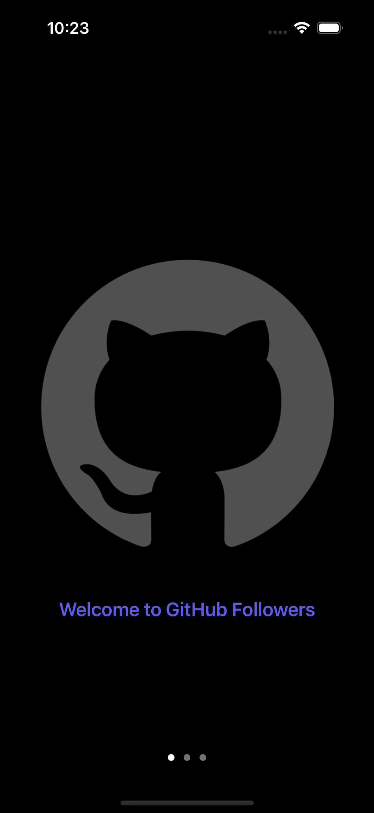
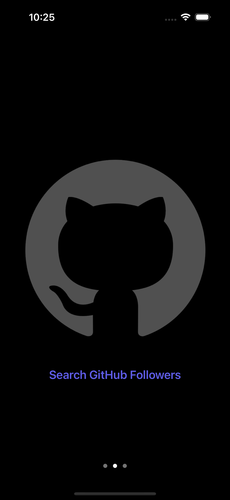
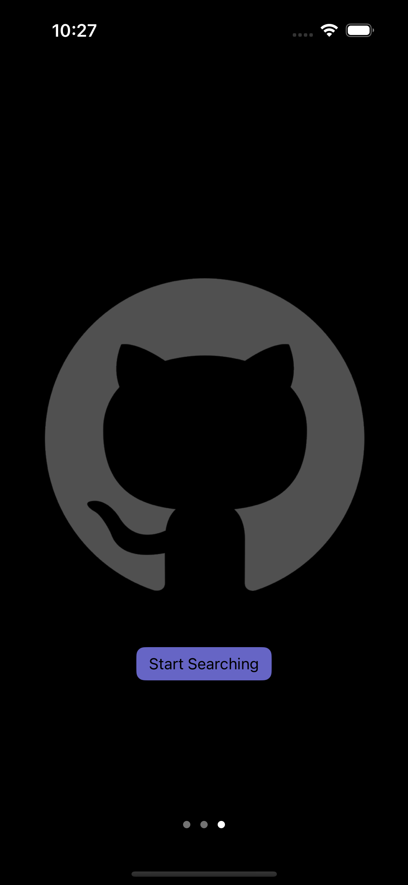
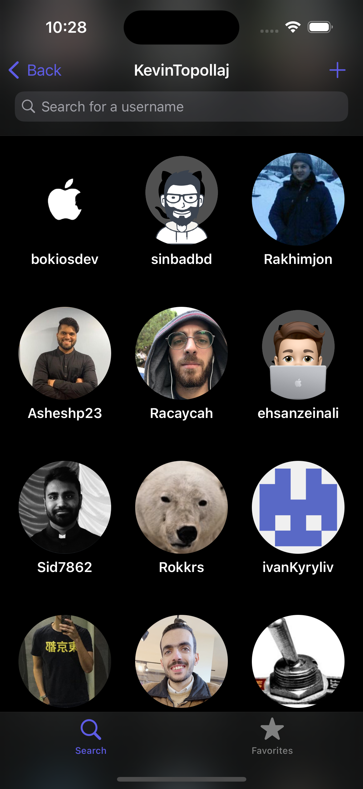
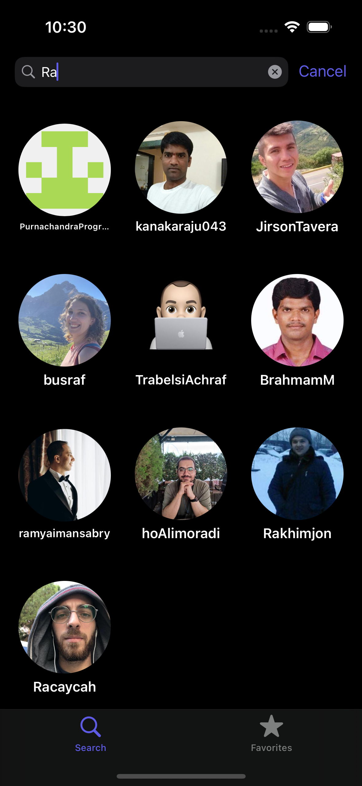
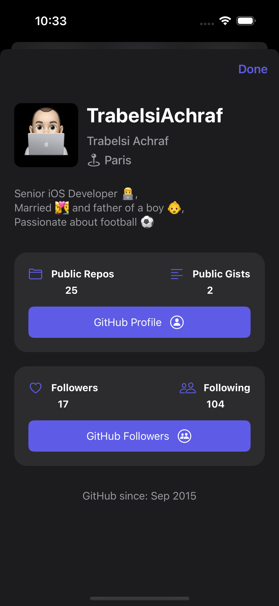
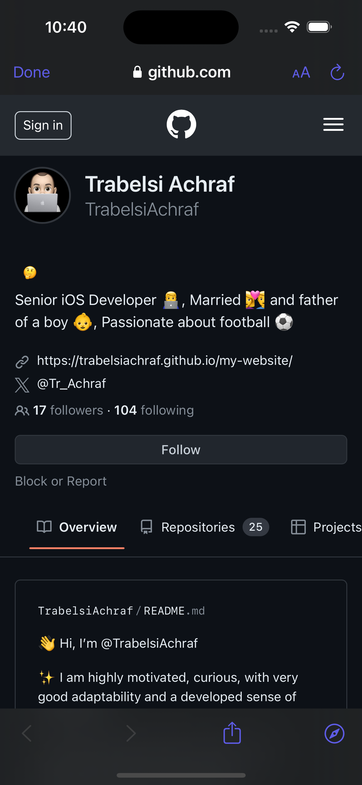
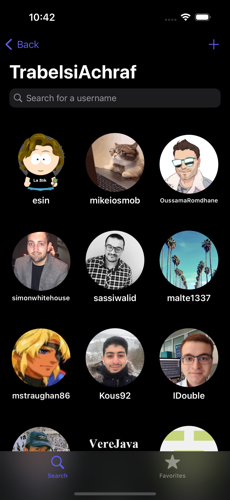
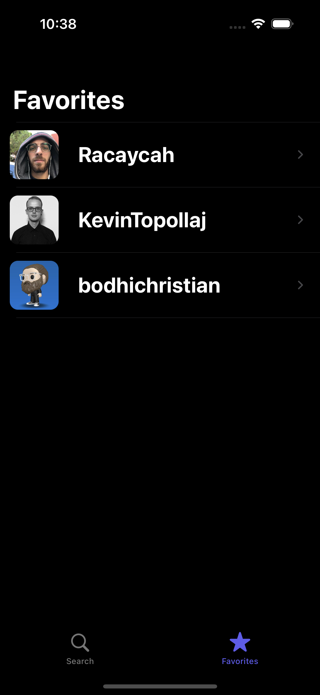

# GitHub Followers

## Table of contents
* [Video Link](#video-link)
* [Description](#description)
* [Features](#Features)
* [Screenshots](#screenshots)
* [Architecture](#architecture)
* [Contact](#contact)

## Video Link

[GitHub Followers]()

## Description

- Introducing GitHub Followers an app that has an all-in-one solution for seamless exploration of user GitHub network. Crafted with precision and attention to detail, this app offers a user-friendly experience from the moment you launch it.

- With GitHub Followers, navigation is a breeze thanks to Coordinators, ensuring smooth transitions between features while maintaining code modularity. It contains an intuitive onboarding process, guiding you through key functionalities for a seamless introduction to the app.

- Experience fast data retrieval powered by Async/Await networking, ensuring responsive interactions as you browse through GitHub user data. The combination of UIKit and SwiftUI delivers dynamic and visually appealing user interfaces, enhancing engagement and interaction.

- It also contains comprehensive state handling mechanisms, providing clear feedback throughout the data fetching process. Plus allows you to keep your favorite GitHub users at your fingertips with the Persistence Manager, ensuring your preferences are saved locally for a personalized experience every time.

## Features

### 1. Implement Programmatic UI using AutoLayout for UIKit:

- The user interfaces is created using programmatic UI using AutoLayout. Implementing programmatic UI ensures adaptability and gives us more control.

### 2. Use a combination of UIKit and SwiftUI to create UI in a composable way:

- Create a dynamic and responsive user interface with UIKit and SwiftUI, embracing its declarative syntax and composable nature to design intuitive and visually appealing layouts to enhance user engagement and interaction.

### 3. Implement Coordinators for Navigation in the App:

- Streamline navigation flow within the app by implementing Coordinators. This architectural pattern enhances code maintainability and scalability, separating navigation logic from view controllers for improved modularity.

### 4. Implement Onboarding:

- Enhance user engagement and familiarity with the app through an intuitive onboarding experience. Guiding users through key features and functionalities during onboarding ensures a smooth and compelling introduction to the GitHub Followers app.

### 5. Implement Networking using Async/Await:

- Using Async/Await to optimize network requests. By leveraging modern Swift concurrency features, ensure responsive user interactions while fetching and displaying GitHub user data efficiently.

### 6. Implement infinite scrolling with pagination:

- Enhance user experience by seamlessly loading additional content through infinite scrolling with pagination, ensuring a fluid browsing experience while efficiently managing large datasets without overwhelming the user.

### 7. Implement state handling for search, loading, empty, error and finished loading:

- Implementing comprehensive state handling mechanisms for search, loading, empty, error and finished loading, to provide a clear feedback to users throughout the data fetching process.

### 8. Implement Error handling:

- Prioritize user satisfaction and app reliability by implementing error handling mechanisms, gracefully managing unexpected errors and edge cases to maintain app stability under various use-cases.

### 9. Navigate to the GitHub profile of a User using Safari:

- The user is able to navigate to a specific User profile in GitHub using Safari.

### 10. Implement Persistence Manager to save favourite users:

- Using a Persistence Manager that allows users to save their favorite GitHub users locally, ensuring their preferences are retained across app sessions.

## Screenshots

  Onboarding Screen 1      |  Onboarding Screen 2
:-------------------------:|:-------------------------:
 | 

  Onboarding Screen 3      |  Search Screen
:-------------------------:|:-------------------------:
 | 

  Followers Grid Screen    | Search In Followers Grid
:-------------------------:| :-------------------------:
 | 

  User Info Screen         |  GitHub profile in Safari
:-------------------------:| :-------------------------:
 | 

 User GitHub Followers Screen  | Favorites Tab Screen
:-----------------------------:| :-------------------------:
 | 

## Architecture

### MVC

GitHub Followers app follows the Model-View-Controller (MVC) architecture pattern, which is commonly used in software development.

### Model:

The Model layer represents the data and business logic of the app. It is responsible for managing the data, storing it, and processing it.

### View:

The View layer is responsible for displaying the data in a user-friendly way. It handles all the layouts and user interface components.

### Controller:

The Controller layer is responsible for handling the business logic of the app. It receives input from the user and communicates with the Model and View to update the data and the user interface.

## Contact

Kevin Topollaj, email: kevintopollaj@gmail.com - feel free to contact me!
